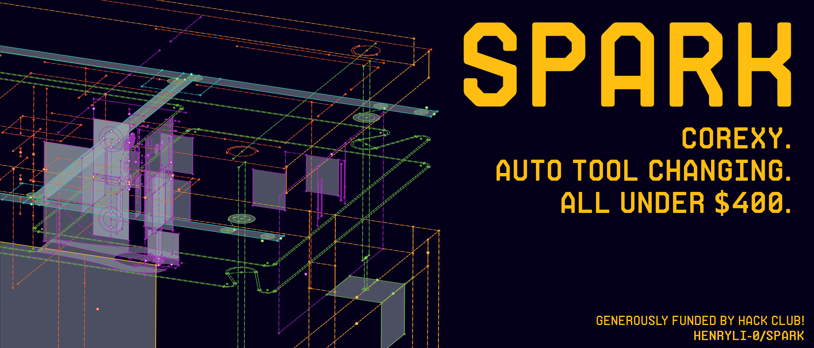

    <h2>Spark</h2>
    
by <a href= "https://github.com/HenryLi-0/spark"> @HenryLi-0 </a>

    

It's all open source! Hardware licensed under CERN OHL S v2.

---

## Spark

henry once again attempts to try something weird (trying to make a 3d printer)

(this is not related to REV and their motor controllers)

(although, would a NEO make for a good spindle motor thingy?)

- see [`updatelogs`](</updatelogs/>) for long writing about ideas and stuff!
- see [`JOURNAL.md`](</JOURNAL.md>) for a condensed version for hack club (this is what i input into the site and they autogenerate that file)